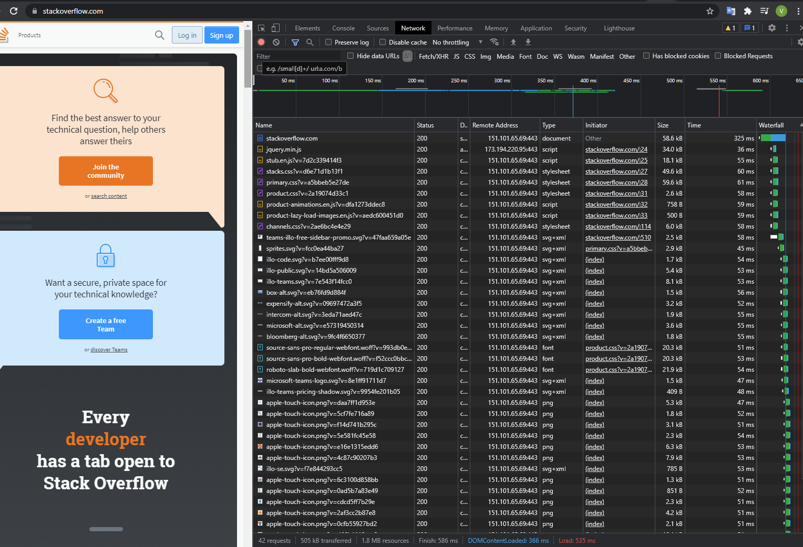

1.Работа c HTTP через телнет.
Подключитесь утилитой телнет к сайту stackoverflow.com telnet stackoverflow.com 80
отправьте HTTP запрос
GET /questions HTTP/1.0
HOST: stackoverflow.com
[press enter]
[press enter]
В ответе укажите полученный HTTP код, что он означает?
```
HTTP/1.1 301 Moved Permanently Код 301 означает, что запрос был перенаправлен на ресурс, указанный в заголовке location.Код 301 означает, что запрос был перенаправлен на ресурс, указанный в заголовке location.
```

```
vagrant@vagrant:~$ telnet stackoverflow.com 80
Trying 151.101.65.69...
Connected to stackoverflow.com.
Escape character is '^]'.
GET /questions HTTP/1.0
HOST: stackoverflow.com

HTTP/1.1 301 Moved Permanently
cache-control: no-cache, no-store, must-revalidate
location: https://stackoverflow.com/questions
x-request-guid: 82e7a897-201f-4d2d-a01f-77c474e338c6
feature-policy: microphone 'none'; speaker 'none'
content-security-policy: upgrade-insecure-requests; frame-ancestors 'self' https://stackexchange.com
Accept-Ranges: bytes
Date: Thu, 09 Sep 2021 22:48:25 GMT
Via: 1.1 varnish
Connection: close
X-Served-By: cache-fra19142-FRA
X-Cache: MISS
X-Cache-Hits: 0
X-Timer: S1631227705.368554,VS0,VE92
Vary: Fastly-SSL
X-DNS-Prefetch-Control: off
Set-Cookie: prov=9dea79c3-3163-0e1e-a610-0b8d923a97f3; domain=.stackoverflow.com; expires=Fri, 01-Jan-2055 00:00:00 GMT; path=/; HttpOnly

Connection closed by foreign host.
vagrant@vagrant:~$
```


2.Повторите задание 1 в браузере, используя консоль разработчика F12.
-откройте вкладку Network
-отправьте запрос http://stackoverflow.com
-найдите первый ответ HTTP сервера, откройте вкладку Headers
-укажите в ответе полученный HTTP код.
-проверьте время загрузки страницы, какой запрос обрабатывался дольше всего?
-приложите скриншот консоли браузера в ответ.

Первый ответ HTTP-сервера - 301 (Moved permanently). Дольше всего обрабатывался запрос https://stackoverflow.co
Первый ответ сервера помлн редиректа:
		
		Request URL: https://stackoverflow.com/
		Request Method: GET
		Status Code: 200 
		Remote Address: 151.101.1.69:443
		Referrer Policy: strict-origin-when-cross-origin
		accept-ranges: bytes
		cache-control: private
		content-encoding: gzip
		content-security-policy: upgrade-insecure-requests; frame-ancestors 'self' https://stackexchange.com
		content-type: text/html; charset=utf-8
		date: Wed, 14 Jul 2021 05:47:44 GMT
		feature-policy: microphone 'none'; speaker 'none'
		strict-transport-security: max-age=15552000
		vary: Accept-Encoding,Fastly-SSL
		via: 1.1 varnish
		x-cache: MISS
		x-cache-hits: 0
		x-dns-prefetch-control: off
		x-frame-options: SAMEORIGIN
		x-request-guid: bca8b6b2-2baf-4b4e-aaa5-05358a234141
		x-served-by: cache-fra19144-FRA
		x-timer: S1626241664.314861,VS0,VE96
		:authority: stackoverflow.com
		:method: GET
		:path: /
		:scheme: https
		accept: text/html,application/xhtml+xml,application/xml;q=0.9,image/avif,image/webp,image/apng,*/*;q=0.8,application/signed-exchange;v=b3;q=0.9
		accept-encoding: gzip, deflate, br
		accept-language: ru-RU,ru;q=0.9,en-US;q=0.8,en;q=0.7
		cookie: prov=c7263ae4-cc89-5c1a-2981-66f87a515624
		sec-ch-ua: " Not;A Brand";v="99", "Google Chrome";v="91", "Chromium";v="91"
		sec-ch-ua-mobile: ?0
		sec-fetch-dest: document
		sec-fetch-mode: navigate
		sec-fetch-site: none
		sec-fetch-user: ?1
		upgrade-insecure-requests: 1
		user-agent: Mozilla/5.0 (Windows NT 6.3; Win64; x64) AppleWebKit/537.36 (KHTML, like Gecko) Chrome/91.0.4472.124 Safari/537.36



	

3.Какой IP адрес у вас в интернете?
```
188.123.230.203
```
```
vagrant@vagrant:~$ dig -4 TXT +short o-o.myaddr.l.google.com @ns1.google.com
"188.123.230.203"
```
4.Какому провайдеру принадлежит ваш IP адрес? Какой автономной системе AS? Воспользуйтесь утилитой whois

```
vagrant@vagrant:~$ whois 188.123.230.203 | grep descr
descr:          public net for NAT CN01
descr:          JSC "AKADO-Stolitsa"
descr:          DOCSIS ISP, Moscow
```
```
vagrant@vagrant:~$ whois 188.123.230.203 | grep origin
origin:         AS15582
```

5.Через какие сети проходит пакет, отправленный с вашего компьютера на адрес 8.8.8.8? Через какие AS? Воспользуйтесь утилитой traceroute
```
AS15582,AS8732,AS15169
```
```
vagrant@vagrant:~$ whois AS15582 | grep org-name
org-name:       OJSC Comcor
vagrant@vagrant:~$ whois AS8732  | grep org-name
org-name:       OJSC Comcor
vagrant@vagrant:~$ whois AS15169 | grep OrgName 
OrgName:        Google LLC
```
```
vagrant@vagrant:~$ traceroute -IAn  8.8.8.8
traceroute to 8.8.8.8 (8.8.8.8), 30 hops max, 60 byte packets
 1  10.0.2.2 [*]  0.341 ms  0.209 ms  0.198 ms
 2  192.168.245.1 [*]  1.451 ms  1.209 ms  0.974 ms
 3  192.168.77.1 [*]  2.993 ms  2.767 ms  2.489 ms
 4  172.23.32.1 [*]  6.561 ms  10.488 ms  10.258 ms
 5  10.244.4.70 [*]  17.674 ms  17.961 ms  18.186 ms
 6  188.123.255.46 [AS15582]  43.783 ms  10.254 ms  10.006 ms
 7  188.123.255.45 [AS15582]  7.956 ms  11.648 ms  11.380 ms
 8  62.117.100.21 [AS8732]  11.557 ms  10.643 ms  10.046 ms
 9  178.208.156.184 [AS8732]  9.779 ms  9.495 ms  11.153 ms
10  172.253.68.11 [AS15169]  8.959 ms  12.119 ms  11.848 ms
11  108.170.250.66 [AS15169]  12.270 ms  12.004 ms  8.766 ms
12  209.85.255.136 [AS15169]  25.812 ms  25.583 ms *
13  209.85.254.20 [AS15169]  27.826 ms  27.601 ms  28.007 ms
14  172.253.51.241 [AS15169]  25.386 ms  24.946 ms  24.674 ms
15  * * *
16  * * *
17  * * *
18  * * *
19  * * *
20  * * *
21  * * *
22  * * *
23  * * *
24  * * *
25  * * *
26  8.8.8.8 [AS15169]  25.068 ms  28.336 ms  28.107 ms
```

6.Повторите задание 5 в утилите mtr. На каком участке наибольшая задержка - delay?

```
хост, отвечающий с наибольшей задержкой - 5. 10.244.4.70, но это, скорее всего связано с медленной обработкой.
участок с наибольшей задержкой - между  11. и 12. , где задержка составляет 11 ms
11. AS15169  108.170.250.66       0.0%     1   13.2  13.2  13.2  13.2   0.0
12. AS15169  209.85.255.136       0.0%     1   24.1  24.1  24.1  24.1   0.0
```
```
vagrant@vagrant:~$ vagrant@vagrant:~$ mtr 8.8.8.8 -znrc 1
Start: 2021-09-09T22:12:18+0000
HOST: vagrant                     Loss%   Snt   Last   Avg  Best  Wrst StDev
  1. AS???    10.0.2.2             0.0%     1    0.7   0.7   0.7   0.7   0.0
  2. AS???    192.168.245.1        0.0%     1    1.6   1.6   1.6   1.6   0.0
  3. AS???    192.168.77.1         0.0%     1    1.8   1.8   1.8   1.8   0.0
  4. AS???    172.23.32.1          0.0%     1    7.9   7.9   7.9   7.9   0.0
  5. AS???    10.244.4.70          0.0%     1  161.0 161.0 161.0 161.0   0.0
  6. AS15582  188.123.255.46       0.0%     1   14.2  14.2  14.2  14.2   0.0
  7. AS15582  188.123.255.45       0.0%     1    8.1   8.1   8.1   8.1   0.0
  8. AS8732   62.117.100.21        0.0%     1    9.1   9.1   9.1   9.1   0.0
  9. AS8732   178.208.156.184      0.0%     1    8.7   8.7   8.7   8.7   0.0
 10. AS15169  172.253.68.11        0.0%     1    9.5   9.5   9.5   9.5   0.0
 11. AS15169  108.170.250.66       0.0%     1   13.2  13.2  13.2  13.2   0.0
 12. AS15169  209.85.255.136       0.0%     1   24.1  24.1  24.1  24.1   0.0
 13. AS15169  209.85.254.20        0.0%     1   28.1  28.1  28.1  28.1   0.0
 14. AS15169  172.253.51.241       0.0%     1   24.6  24.6  24.6  24.6   0.0
 15. AS???    ???                 100.0     1    0.0   0.0   0.0   0.0   0.0
 16. AS???    ???                 100.0     1    0.0   0.0   0.0   0.0   0.0
 17. AS???    ???                 100.0     1    0.0   0.0   0.0   0.0   0.0
 18. AS???    ???                 100.0     1    0.0   0.0   0.0   0.0   0.0
 19. AS???    ???                 100.0     1    0.0   0.0   0.0   0.0   0.0
 20. AS???    ???                 100.0     1    0.0   0.0   0.0   0.0   0.0
 21. AS???    ???                 100.0     1    0.0   0.0   0.0   0.0   0.0
 22. AS???    ???                 100.0     1    0.0   0.0   0.0   0.0   0.0
 23. AS???    ???                 100.0     1    0.0   0.0   0.0   0.0   0.0
 24. AS???    ???                 100.0     1    0.0   0.0   0.0   0.0   0.0
 25. AS???    ???                 100.0     1    0.0   0.0   0.0   0.0   0.0
 26. AS15169  8.8.8.8              0.0%     1   25.5  25.5  25.5  25.5   0.0
```

7.Какие DNS сервера отвечают за доменное имя dns.google? Какие A записи? воспользуйтесь утилитой dig
```
vagrant@vagrant:~$ dig +short NS dns.google
ns3.zdns.google.
ns1.zdns.google.
ns4.zdns.google.
ns2.zdns.google.
```
```
vagrant@vagrant:~$ dig +short A dns.google
8.8.8.8
8.8.4.4
```
9.Проверьте PTR записи для IP адресов из задания 7. Какое доменное имя привязано к IP? воспользуйтесь утилитой dig
```
8.8.4.4 dns.google
8.8.8.8 dns.google
```
```
vagrant@vagrant:~$ dig -x 8.8.8.8

; <<>> DiG 9.16.1-Ubuntu <<>> -x 8.8.8.8
;; global options: +cmd
;; Got answer:
;; ->>HEADER<<- opcode: QUERY, status: NOERROR, id: 40991
;; flags: qr rd ra; QUERY: 1, ANSWER: 1, AUTHORITY: 0, ADDITIONAL: 1

;; OPT PSEUDOSECTION:
; EDNS: version: 0, flags:; udp: 65494
;; QUESTION SECTION:
;8.8.8.8.in-addr.arpa.          IN      PTR

;; ANSWER SECTION:
8.8.8.8.in-addr.arpa.   6991    IN      PTR     dns.google.

;; Query time: 0 msec
;; SERVER: 127.0.0.53#53(127.0.0.53)
;; WHEN: Thu Sep 09 22:15:26 UTC 2021
;; MSG SIZE  rcvd: 73

vagrant@vagrant:~$ dig -x 8.8.4.4

; <<>> DiG 9.16.1-Ubuntu <<>> -x 8.8.4.4
;; global options: +cmd
;; Got answer:
;; ->>HEADER<<- opcode: QUERY, status: NOERROR, id: 50346
;; flags: qr rd ra; QUERY: 1, ANSWER: 1, AUTHORITY: 0, ADDITIONAL: 1

;; OPT PSEUDOSECTION:
; EDNS: version: 0, flags:; udp: 65494
;; QUESTION SECTION:
;4.4.8.8.in-addr.arpa.          IN      PTR

;; ANSWER SECTION:
4.4.8.8.in-addr.arpa.   7155    IN      PTR     dns.google.

;; Query time: 0 msec
;; SERVER: 127.0.0.53#53(127.0.0.53)
;; WHEN: Thu Sep 09 22:15:35 UTC 2021
;; MSG SIZE  rcvd: 73
```
