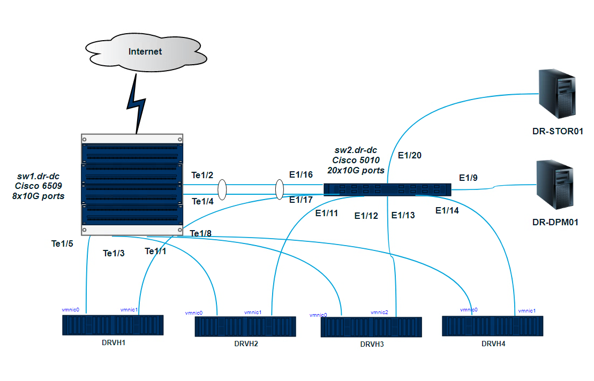

1.Подключитесь к публичному маршрутизатору в интернет. Найдите маршрут к вашему публичному IP
```
telnet route-views.routeviews.org
Username: rviews
show ip route x.x.x.x/32
show bgp x.x.x.x/32
```

```
Username: rviews
route-views>show ip route 91.77.245.176/32
                                       ^
% Invalid input detected at '^' marker.

route-views>show ip route 91.77.245.176
Routing entry for 91.76.0.0/14
  Known via "bgp 6447", distance 20, metric 0
  Tag 2497, type external
  Last update from 202.232.0.2 7w0d ago
  Routing Descriptor Blocks:
  * 202.232.0.2, from 202.232.0.2, 7w0d ago
      Route metric is 0, traffic share count is 1
      AS Hops 2
      Route tag 2497
      MPLS label: none
route-views>show bgp  91.77.245.176
BGP routing table entry for 91.76.0.0/14, version 133581250
Paths: (24 available, best #20, table default)
  Not advertised to any peer
  Refresh Epoch 1
  701 3356 8359
    137.39.3.55 from 137.39.3.55 (137.39.3.55)
      Origin IGP, localpref 100, valid, external
      path 7FE15B742128 RPKI State not found
      rx pathid: 0, tx pathid: 0
  Refresh Epoch 1
  20912 3257 3356 8359
    212.66.96.126 from 212.66.96.126 (212.66.96.126)
      Origin IGP, localpref 100, valid, external
      Community: 3257:8070 3257:30515 3257:50001 3257:53900 3257:53902 20912:65004
      path 7FE1265D0010 RPKI State not found
      rx pathid: 0, tx pathid: 0
  Refresh Epoch 1
  7660 2516 1299 8359
    203.181.248.168 from 203.181.248.168 (203.181.248.168)
      Origin IGP, localpref 100, valid, external
      Community: 2516:1030 7660:9003
      path 7FE11C581EE8 RPKI State not found
      rx pathid: 0, tx pathid: 0
  Refresh Epoch 1
  3267 1299 8359
    194.85.40.15 from 194.85.40.15 (185.141.126.1)
      Origin IGP, metric 0, localpref 100, valid, external
      path 7FE161FFB948 RPKI State not found
      rx pathid: 0, tx pathid: 0
  Refresh Epoch 1

route-views>show bgp  91.77.245.176/32
% Network not in table
route-views>
```

2.Создайте dummy0 интерфейс в Ubuntu. Добавьте несколько статических маршрутов. Проверьте таблицу маршрутизации.

```
vagrant@vagrant-ubuntu-trusty-64:~$ ip route
default via 10.0.2.2 dev eth0
10.0.2.0/24 dev eth0  proto kernel  scope link  src 10.0.2.15
192.168.100.0/24 dev dummy0  proto kernel  scope link  src 192.168.100.100
192.168.101.0/24 dev dummy0  scope link
192.168.102.0/24 dev dummy0  scope link
vagrant@vagrant-ubuntu-trusty-64:~$ netstat -rn
Kernel IP routing table
Destination     Gateway         Genmask         Flags   MSS Window  irtt Iface
0.0.0.0         10.0.2.2        0.0.0.0         UG        0 0          0 eth0
10.0.2.0        0.0.0.0         255.255.255.0   U         0 0          0 eth0
192.168.100.0   0.0.0.0         255.255.255.0   U         0 0          0 dummy0
192.168.101.0   0.0.0.0         255.255.255.0   U         0 0          0 dummy0
192.168.102.0   0.0.0.0         255.255.255.0   U         0 0          0 dummy0
```

3.Проверьте открытые TCP порты в Ubuntu, какие протоколы и приложения используют эти порты? Приведите несколько примеров.

22 - sshd
111 - rpcbind

```
vagrant@vagrant-ubuntu-trusty-64:~$ sudo ss -tapn
State      Recv-Q Send-Q        Local Address:Port          Peer Address:Port
LISTEN     0      128                       *:111                      *:*      users:(("rpcbind",529,8))
LISTEN     0      128                       *:22                       *:*      users:(("sshd",1256,3))
LISTEN     0      128                       *:39210                    *:*      users:(("rpc.statd",569,8))
ESTAB      0      0                 10.0.2.15:22                10.0.2.2:1060   users:(("sshd",1933,3),("sshd",1864,3))
LISTEN     0      128                      :::111                     :::*      users:(("rpcbind",529,11))
LISTEN     0      128                      :::22                      :::*      users:(("sshd",1256,4))
LISTEN     0      128                      :::35583                   :::*      users:(("rpc.statd",569,10))
```

4.Проверьте используемые UDP сокеты в Ubuntu, какие протоколы и приложения используют эти порты?

68 - dhclient
111- RPCBIND


```
vagrant@vagrant-ubuntu-trusty-64:~$ sudo ss -uapn
State       Recv-Q Send-Q                             Local Address:Port                               Peer Address:Port
UNCONN      0      0                                              *:68                                            *:*      users:(("dhclient",534,5))
UNCONN      0      0                                              *:54627                                         *:*      users:(("rpc.statd",569,7))
UNCONN      0      0                                              *:111                                           *:*      users:(("rpcbind",529,6))
UNCONN      0      0                                              *:31890                                         *:*      users:(("dhclient",534,20))
UNCONN      0      0                                              *:698                                           *:*      users:(("rpcbind",529,7))
UNCONN      0      0                                      127.0.0.1:745                                           *:*      users:(("rpc.statd",569,4))
UNCONN      0      0                                             :::111                                          :::*      users:(("rpcbind",529,9))
UNCONN      0      0                                             :::53117                                        :::*      users:(("rpc.statd",569,9))
UNCONN      0      0                                             :::39840                                        :::*      users:(("dhclient",534,21))
UNCONN      0      0                                             :::698                                          :::*      users:(("rpcbind",529,10))
```

5. Используя diagrams.net, создайте L3 диаграмму вашей домашней сети или любой другой сети, с которой вы работали.


