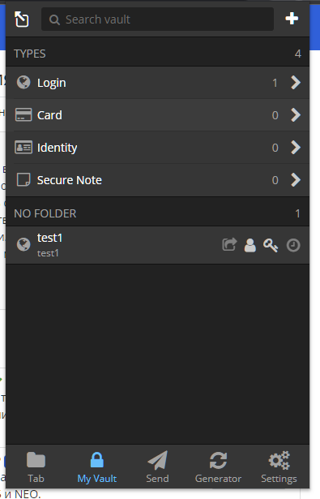
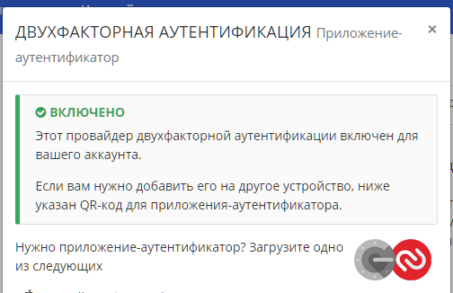
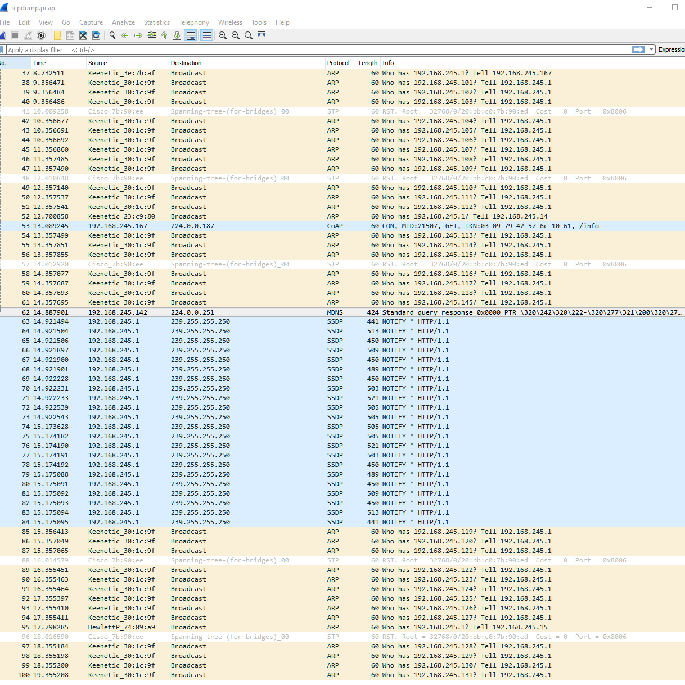

1.Установите Bitwarden плагин для браузера. Зарегестрируйтесь и сохраните несколько паролей.


2.Установите Google authenticator на мобильный телефон. Настройте вход в Bitwarden акаунт через Google authenticator OTP.



3.Установите apache2, сгенерируйте самоподписанный сертификат, настройте тестовый сайт для работы по HTTPS.

Установил apache
```
sudo apt update
sudo apt install apache2
```
создал  Self-Signed Certificate
```
sudo openssl req -x509 -nodes -days 365 -newkey rsa:2048 -keyout /etc/ssl/private/test.com.key -out /etc/ssl/certs/test.com.crt
```

установил сертификат
```
sudo nano /etc/apache2/sites-available/default-ssl.conf

<IfModule mod_ssl.c>
 <VirtualHost _default_:443>       

                SSLCertificateFile      /etc/ssl/certs/test.com.crt
                SSLCertificateKeyFile   /etc/ssl/private/test.com.key
                #
                #SSLCertificateFile      /etc/ssl/certs/ssl-cert-snakeoil.pem
                #SSLCertificateKeyFile /etc/ssl/private/ssl-cert-snakeoil.key
 </VirtualHost>
</IfModule>
```
настроил редирект HTTP->HTTPS
```
sudo nano /etc/apache2/sites-available/000-default.conf

<VirtualHost *:80>
        . . .
        Redirect permanent "/" "https://test.com/"
        . . .
</VirtualHost>

sudo systemctl restart apache2
```


4.Проверьте на TLS уязвимости произвольный сайт в интернете.
```
vagrant@ubuntu-1804-test:~$ testssl -U habr.com

###########################################################
    testssl.sh       3.0.4 from https://testssl.sh/

      This program is free software. Distribution and
             modification under GPLv2 permitted.
      USAGE w/o ANY WARRANTY. USE IT AT YOUR OWN RISK!

       Please file bugs @ https://testssl.sh/bugs/

###########################################################

 Using "OpenSSL 1.0.2-chacha (1.0.2k-dev)" [~183 ciphers]
 on ubuntu-1804-test:/snap/testssl/20/bin/openssl.Linux.x86_64
 (built: "Jan 18 17:12:17 2019", platform: "linux-x86_64")


 Start 2021-10-01 21:24:24        -->> 178.248.237.68:443 (habr.com) <<--

 rDNS (178.248.237.68):  --
 Service detected:       HTTP


 Testing vulnerabilities

 Heartbleed (CVE-2014-0160)                not vulnerable (OK), no heartbeat extension
 CCS (CVE-2014-0224)                       not vulnerable (OK)
 Ticketbleed (CVE-2016-9244), experiment.  not vulnerable (OK)
 ROBOT                                     not vulnerable (OK)
 Secure Renegotiation (RFC 5746)           supported (OK)
 Secure Client-Initiated Renegotiation     not vulnerable (OK)
 CRIME, TLS (CVE-2012-4929)                not vulnerable (OK)
 BREACH (CVE-2013-3587)                    no HTTP compression (OK)  - only supplied "/" tested
 POODLE, SSL (CVE-2014-3566)               not vulnerable (OK)
 TLS_FALLBACK_SCSV (RFC 7507)              No fallback possible (OK), no protocol below TLS 1.2 offered
 SWEET32 (CVE-2016-2183, CVE-2016-6329)    VULNERABLE, uses 64 bit block ciphers
 FREAK (CVE-2015-0204)                     not vulnerable (OK)
 DROWN (CVE-2016-0800, CVE-2016-0703)      not vulnerable on this host and port (OK)
                                           make sure you don't use this certificate elsewhere with SSLv2 enabled services
                                           https://censys.io/ipv4?q=67D611E244CEAEBB45860B7B514BE56D4DF9E253591B1086811C33892C479A3F could help you to find out
 LOGJAM (CVE-2015-4000), experimental      not vulnerable (OK): no DH EXPORT ciphers, no DH key detected with <= TLS 1.2
 BEAST (CVE-2011-3389)                     not vulnerable (OK), no SSL3 or TLS1
 LUCKY13 (CVE-2013-0169), experimental     potentially VULNERABLE, uses cipher block chaining (CBC) ciphers with TLS. Check patches
 RC4 (CVE-2013-2566, CVE-2015-2808)        no RC4 ciphers detected (OK)


 Done 2021-10-01 21:24:52 [  31s] -->> 178.248.237.68:443 (habr.com) <<--
```


5.Установите на Ubuntu ssh сервер, сгенерируйте новый приватный ключ. Скопируйте свой публичный ключ на другой сервер. Подключитесь к серверу по SSH-ключу.
```
vagrant@ubuntu-1804-test:~$ ssh-keygen
Generating public/private rsa key pair.
Enter file in which to save the key (/home/vagrant/.ssh/id_rsa):
Enter passphrase (empty for no passphrase):
Enter same passphrase again:
Your identification has been saved in /home/vagrant/.ssh/id_rsa.
Your public key has been saved in /home/vagrant/.ssh/id_rsa.pub.
The key fingerprint is:
SHA256:FrNIQQwQxKAiOJtq1ILqpzup/l2jaDZjUGKIQ/GZwvI vagrant@ubuntu-1804-test
The key's randomart image is:
+---[RSA 2048]----+
|.==o.+o          |
|+.o o ..         |
|@o +  . o        |
|OBo. . . +       |
|=+E.  . S        |
|+..    .         |
|o.o    o         |
|oo Bo o .        |
|+=Xooo           |
+----[SHA256]-----+
```

Скопируем свой публичный ключ на другой сервер
```
vagrant@ubuntu-1804-test:~$ sh-copy-id vagrant@192.168.245.199
```
Теперь с сервера 192.168.245.199 можноподключаться к серверу без пароля:

```
vagrant@ubuntu2:~$  ssh 'vagrant@192.168.245.188'
vagrant@ubuntu-1804-test:~$ 
```

6.Переименуйте файлы ключей из задания 5. Настройте файл конфигурации SSH клиента, так чтобы вход на удаленный сервер осуществлялся по имени сервера.
```
vagrant@ubuntu-1804-test:~$ mv id_rsa id_srv
vagrant@ubuntu-1804-test:~$ mv id_rsa.pub id_srv.pub

vagrant@ubuntu-1804-test:~$ mkdir -p ~/.ssh 
vagrant@ubuntu-1804-test:~$ chmod 700 ~/.ssh
vagrant@ubuntu-1804-test:~$ touch ~/.ssh/config 
vagrant@ubuntu-1804-test:~$ chmod 600 ~/.ssh/config
vagrant@ubuntu-1804-test:~$ vi /root/.ssh/config
Host ubuntu1
    HostName 192.168.245.188
    IdentityFile ~/.ssh/id_srv.pub
    User vagrant

Host *
    User default_username
    IdentityFile ~/.ssh/id_srv
    Protocol 2
```


7.Соберите дамп трафика утилитой tcpdump в формате pcap, 100 пакетов. Откройте файл pcap в Wireshark.


