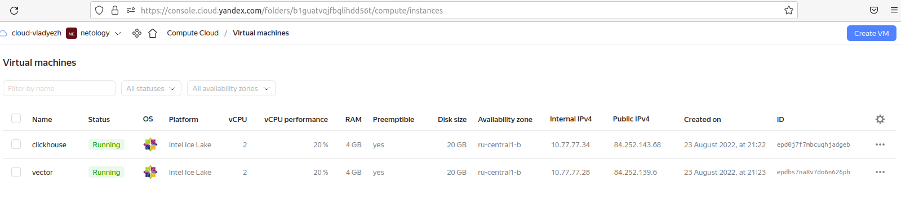

# Домашнее задание к занятию "08.02 Работа с Playbook"

## Подготовка к выполнению

1. (Необязательно) Изучите, что такое [clickhouse](https://www.youtube.com/watch?v=fjTNS2zkeBs) и [vector](https://www.youtube.com/watch?v=CgEhyffisLY)
2. Создайте свой собственный (или используйте старый) публичный репозиторий на github с произвольным именем.
3. Скачайте [playbook](./playbook/) из репозитория с домашним заданием и перенесите его в свой репозиторий.
4. Подготовьте хосты в соответствии с группами из предподготовленного playbook.



## Основная часть

1. Приготовьте свой собственный inventory файл `prod.yml`.
```
vlad@vlad705:~/nl/08-ansible-02-playbook$ cat ./playbook/inventory/prod.yml 
---
clickhouse:
  hosts:
    clickhouse-01:
      ansible_host: 84.252.143.68
vector:
  hosts:
    vector-01:
      ansible_host: 84.252.139.6
```
2. Допишите playbook: нужно сделать ещё один play, который устанавливает и настраивает [vector](https://vector.dev).
3. При создании tasks рекомендую использовать модули: `get_url`, `template`, `unarchive`, `file`.
4. Tasks должны: скачать нужной версии дистрибутив, выполнить распаковку в выбранную директорию, установить vector.
5. Запустите `ansible-lint site.yml` и исправьте ошибки, если они есть.
6. Попробуйте запустить playbook на этом окружении с флагом `--check`.
7. Запустите playbook на `prod.yml` окружении с флагом `--diff`. Убедитесь, что изменения на системе произведены.
8. Повторно запустите playbook с флагом `--diff` и убедитесь, что playbook идемпотентен.
9. Подготовьте README.md файл по своему playbook. В нём должно быть описано: что делает playbook, какие у него есть параметры и теги.
```
Install Clickhouse - указывается handler для перезапуска сервиса  
Get clickhouse distrib - скачиваются необходимые пакеты, список и версии берутся из переменные в groups_vars. В случае если get_url не сработал, запускается rescue, подставляются новые значения в url    
Install clickhouse packages - устанавливаются скачанные пакеты  
Start clickhouse-server - запускается  сервер
Create database - Создаётся БД logs, идет проверка на ошибки и записыватся статус выполнения    


Install Vector - указывается handler для перезапуска сервиса
Get vector distrib - скачиваются необходимые пакеты, список и версии берутся из переменные в groups_vars
Install vector package -  устанавливаются скачанные пакеты , оповещается handler для перезапуска сервиса 

```

10. Готовый playbook выложите в свой репозиторий, поставьте тег `08-ansible-02-playbook` на фиксирующий коммит, в ответ предоставьте ссылку на него.

---

### Как оформить ДЗ?

Выполненное домашнее задание пришлите ссылкой на .md-файл в вашем репозитории.

---
