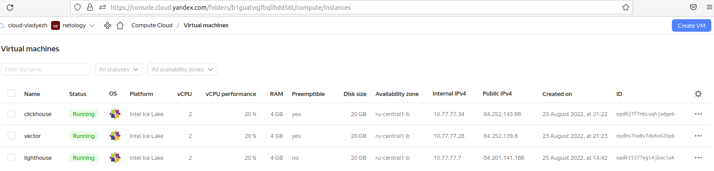
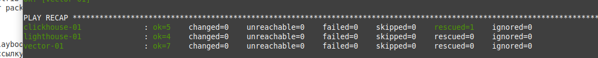

# Домашнее задание к занятию "08.03 Использование Yandex Cloud"

## Подготовка к выполнению

1. Подготовьте в Yandex Cloud три хоста: для `clickhouse`, для `vector` и для `lighthouse`.

Ссылка на репозиторий LightHouse: https://github.com/VKCOM/lighthouse


## Основная часть

1. Допишите playbook: нужно сделать ещё один play, который устанавливает и настраивает lighthouse.
'''
---
clickhouse:
  hosts:
    clickhouse-01:
      ansible_host: 84.252.143.68
vector:
  hosts:
    vector-01:
      ansible_host: 84.252.139.6
lighthouse:
  hosts:
    lighthouse-01:
      ansible_host: 84.201.141.166
'''
2. При создании tasks рекомендую использовать модули: `get_url`, `template`, `yum`, `apt`.
3. Tasks должны: скачать статику lighthouse, установить nginx или любой другой webserver, настроить его конфиг для открытия lighthouse, запустить webserver.
4. Приготовьте свой собственный inventory файл `prod.yml`.
5. Запустите `ansible-lint site.yml` и исправьте ошибки, если они есть.
6. Попробуйте запустить playbook на этом окружении с флагом `--check`.
7. Запустите playbook на `prod.yml` окружении с флагом `--diff`. Убедитесь, что изменения на системе произведены.
8. Повторно запустите playbook с флагом `--diff` и убедитесь, что playbook идемпотентен.


9. Подготовьте README.md файл по своему playbook. В нём должно быть описано: что делает playbook, какие у него есть параметры и теги.
```
Install Clickhouse - указывается handler для перезапуска сервиса  
Get clickhouse distrib - скачиваются необходимые пакеты, список и версии берутся из переменные в groups_vars. В случае если get_url не сработал, запускается rescue, подставляются новые значения в url    
Install clickhouse packages - устанавливаются скачанные пакеты  
Start clickhouse-server - запускается  сервер
Create database - Создаётся БД logs, идет проверка на ошибки и записыватся статус выполнения    


Install Vector - указывается handler для перезапуска сервиса
Get vector distrib - скачиваются необходимые пакеты, список и версии берутся из переменные в groups_vars
Install vector package -  устанавливаются скачанные пакеты , оповещается handler для перезапуска сервиса

Install  Nginx - указываются handlers для старта и перезапуска сервиса
NGINX | Install eper-release - добавляется нужный репо
NGINX | Install Nginx -  устанавливается nginx , оповещается handler для запуска сервиса  
NGINX | Create general config -  создается конфиг, оповещается handler для перезапуска сервиса
```

10. Готовый playbook выложите в свой репозиторий, поставьте тег `08-ansible-03-yandex` на фиксирующий коммит, в ответ предоставьте ссылку на него.

---

### Как оформить ДЗ?

Выполненное домашнее задание пришлите ссылкой на .md-файл в вашем репозитории.
