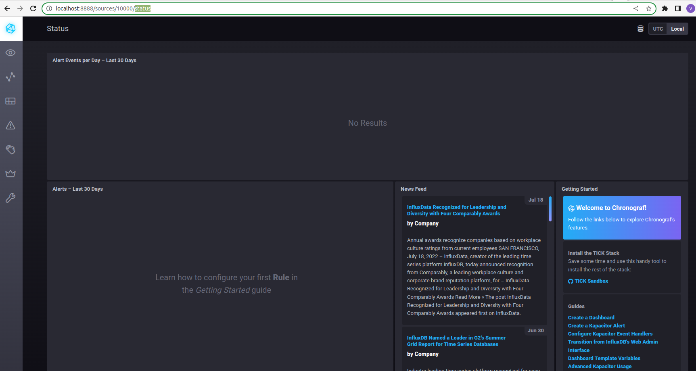
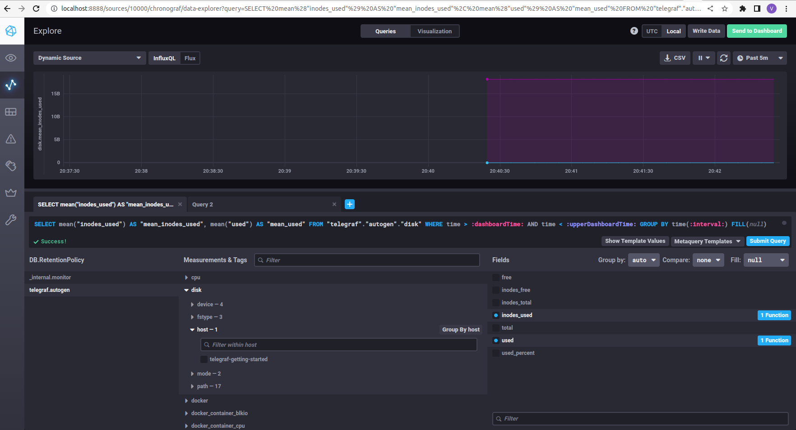
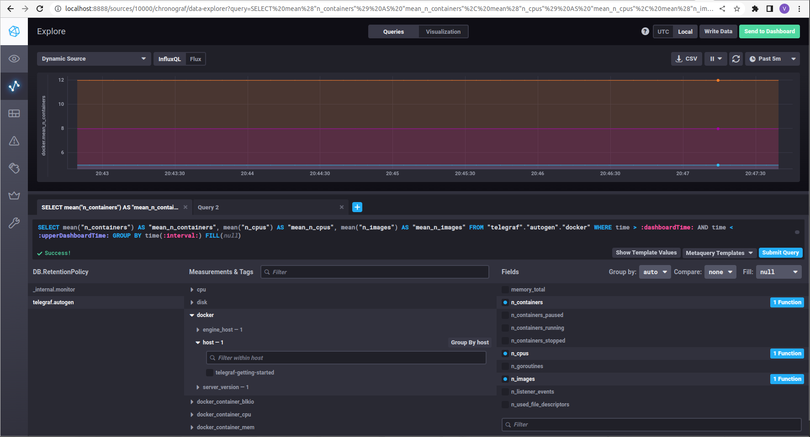

# Домашнее задание к занятию "10.02. Системы мониторинга"

## Обязательные задания

1. Опишите основные плюсы и минусы pull и push систем мониторинга.
```
Push
- сервер ожидает подключений от агентов для получения метрик.
- имеет более гибкую настройка отправки пакетов данных с метриками
- менее затратный способом передачи данных

Pull 
- сервер мониторинга сам подключается к агентам мониторинга и забирает данные.
- легче контролировать подлинность данных
- упрощенная отладка получения данных с агентов
```

2. Какие из ниже перечисленных систем относятся к push модели, а какие к pull? А может есть гибридные?

    - Prometheus 
    - TICK
    - Zabbix
    - VictoriaMetrics
    - Nagios
```
    - Prometheus - Pull
    - TICK - Push
    - Zabbix - Push и Pull
    - VictoriaMetrics - Push
    - Nagios - Pull
```

3. Склонируйте себе [репозиторий](https://github.com/influxdata/sandbox/tree/master) и запустите TICK-стэк, 
используя технологии docker и docker-compose.
В виде решения на это упражнение приведите выводы команд с вашего компьютера (виртуальной машины):

    - curl http://localhost:8086/ping
    - curl http://localhost:8888
    - curl http://localhost:9092/kapacitor/v1/ping

А также скриншот веб-интерфейса ПО chronograf (`http://localhost:8888`). 

P.S.: если при запуске некоторые контейнеры будут падать с ошибкой - проставьте им режим `Z`, например
`./data:/var/lib:Z`

```
vlad@vlad705:~/nl$ git clone https://github.com/influxdata/sandbox.git
Cloning into 'sandbox'...
remote: Enumerating objects: 1718, done.
remote: Counting objects: 100% (32/32), done.
remote: Compressing objects: 100% (22/22), done.
remote: Total 1718 (delta 13), reused 25 (delta 10), pack-reused 1686
Receiving objects: 100% (1718/1718), 7.17 MiB | 8.83 MiB/s, done.
Resolving deltas: 100% (946/946), done.
vlad@vlad705:~/nl$ ls -la
total 12
drwxrwxr-x  3 vlad vlad 4096 Aug 18 19:13 .
drwxr-xr-x 42 vlad vlad 4096 Aug 18 19:13 ..
drwxrwxr-x  8 vlad vlad 4096 Aug 18 19:14 sandbox
```
```
vlad@vlad705:~/nl/sandbox$ curl http://localhost:8086/ping -v
*   Trying 127.0.0.1:8086...
* TCP_NODELAY set
* Connected to localhost (127.0.0.1) port 8086 (#0)
> GET /ping HTTP/1.1
> Host: localhost:8086
> User-Agent: curl/7.68.0
> Accept: */*
> 
* Mark bundle as not supporting multiuse
< HTTP/1.1 204 No Content
< Content-Type: application/json
< Request-Id: 88dc3364-1f1a-11ed-83a6-0242ac120003
< X-Influxdb-Build: OSS
< X-Influxdb-Version: 1.8.10
< X-Request-Id: 88dc3364-1f1a-11ed-83a6-0242ac120003
< Date: Thu, 18 Aug 2022 17:23:54 GMT
< 
```
```
vlad@vlad705:~/nl/sandbox$ curl http://localhost:8888
<!DOCTYPE html><html><head><meta http-equiv="Content-type" content="text/html; charset=utf-8"><title>Chronograf</title><link rel="icon shortcut" href="/favicon.fa749080.ico"><link rel="stylesheet" href="/src.9cea3e4e.css"></head><body> <div id="react-root" data-basepath=""></div> <script src="/src.a969287c.js"></script> </body></html>
```
```
vlad@vlad705:~/nl/sandbox$ curl http://localhost:9092/kapacitor/9092/kapacitor/v1 -v
*   Trying 127.0.0.1:9092...
* TCP_NODELAY set
* Connected to localhost (127.0.0.1) port 9092 (#0)
> GET /kapacitor/v1/-vping HTTP/1.1
> Host: localhost:9092
> User-Agent: curl/7.68.0
> Accept: */*
> 
* Mark bundle as not supporting multiuse
< HTTP/1.1 404 Not Found
< Content-Type: application/json; charset=utf-8
< Request-Id: b70c8a41-1f1a-11ed-8372-000000000000
< X-Kapacitor-Version: 1.6.4
< Date: Thu, 18 Aug 2022 17:25:11 GMT
< Content-Length: 56
< 
{
    "error": "Not Found",
    "message": "Not Found"
* Connection #0 to host localhost left intact
```
<br>

4. Перейдите в веб-интерфейс Chronograf (`http://localhost:8888`) и откройте вкладку `Data explorer`.

    - Нажмите на кнопку `Add a query`
    - Изучите вывод интерфейса и выберите БД `telegraf.autogen`
    - В `measurments` выберите mem->host->telegraf_container_id , а в `fields` выберите used_percent. 
    Внизу появится график утилизации оперативной памяти в контейнере telegraf.
    - Вверху вы можете увидеть запрос, аналогичный SQL-синтаксису. 
    Поэкспериментируйте с запросом, попробуйте изменить группировку и интервал наблюдений.

Для выполнения задания приведите скриншот с отображением метрик утилизации места на диске 
(disk->host->telegraf_container_id) из веб-интерфейса.

В telegraf/telegraf.conf прищлось добавить [[inputs.mem]] и [[inputs.disk]]

<br>

5. Изучите список [telegraf inputs](https://github.com/influxdata/telegraf/tree/master/plugins/inputs). 
Добавьте в конфигурацию telegraf следующий плагин - [docker](https://github.com/influxdata/telegraf/tree/master/plugins/inputs/docker):
```
[[inputs.docker]]
  endpoint = "unix:///var/run/docker.sock"
```

Дополнительно вам может потребоваться донастройка контейнера telegraf в `docker-compose.yml` дополнительного volume и 
режима privileged:
```
  telegraf:
    image: telegraf:1.4.0
    privileged: true
    volumes:
      - ./etc/telegraf.conf:/etc/telegraf/telegraf.conf:Z
      - /var/run/docker.sock:/var/run/docker.sock:Z
    links:
      - influxdb
    ports:
      - "8092:8092/udp"
      - "8094:8094"
      - "8125:8125/udp"
```

После настройке перезапустите telegraf, обновите веб интерфейс и приведите скриншотом список `measurments` в 
веб-интерфейсе базы telegraf.autogen . Там должны появиться метрики, связанные с docker.

<br>


---
