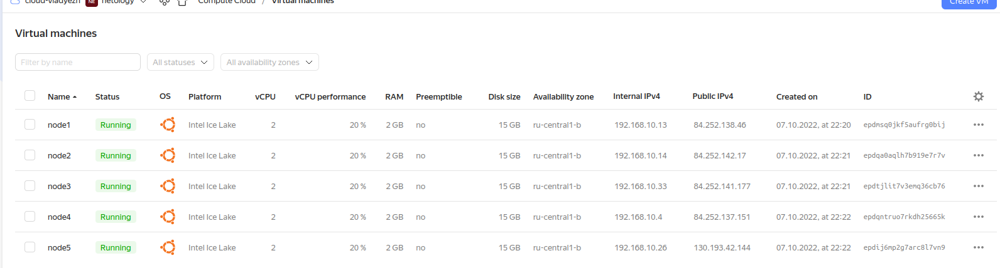

## Задание 1: Подготовить инвентарь kubespray
Новые тестовые кластеры требуют типичных простых настроек. Нужно подготовить инвентарь и проверить его работу. Требования к инвентарю:
* подготовка работы кластера из 5 нод: 1 мастер и 4 рабочие ноды;
* в качестве CRI — containerd;
* запуск etcd производить на мастере.
-----------------------
- Склонирован репозиторий kubespray
```
vlad@vlad705:~/nl/12.4new$ git clone https://github.com/kubernetes-sigs/kubespray
Cloning into 'kubespray'...
remote: Enumerating objects: 64366, done.
remote: Counting objects: 100% (171/171), done.
remote: Compressing objects: 100% (136/136), done.
remote: Total 64366 (delta 63), reused 117 (delta 27), pack-reused 64195
Receiving objects: 100% (64366/64366), 20.40 MiB | 8.60 MiB/s, done.
Resolving deltas: 100% (36207/36207), done.

```
- Установлены зависимости
```
vlad@vlad705:~/nl/12.4new$ cd kubespray/
vlad@vlad705:~/nl/12.4new/kubespray$  sudo pip3 install -r requirements.txt
/usr/lib/python3/dist-packages/secretstorage/dhcrypto.py:15: CryptographyDeprecationWarning: int_from_bytes is deprecated, use int.from_bytes instead
  from cryptography.utils import int_from_bytes
...
Requirement already satisfied: pycparser in /usr/local/lib/python3.8/dist-packages (from cffi>=1.12->cryptography==3.4.8->-r requirements.txt (line 3)) (2.21)
```
- Создан inventory из примера
```
vlad@vlad705:~/nl/12.4new/kubespray$ cp -rfp inventory/sample inventory/cluster
```
- Подготовлены машины в YC  
      
    
- Изменен inventory.ini
```
# ## Configure 'ip' variable to bind kubernetes services on a
# ## different ip than the default iface
# ## We should set etcd_member_name for etcd cluster. The node that is not a etcd member do not need to set the value, or can set the empty string value.
[all]
 node1 ansible_host=84.252.138.46  # ip=10.3.0.1 etcd_member_name=etcd1
 node2 ansible_host=84.252.142.17  # ip=10.3.0.2 etcd_member_name=etcd2
 node3 ansible_host=84.252.141.177  # ip=10.3.0.3 etcd_member_name=etcd3
 node4 ansible_host=84.252.137.151 # ip=10.3.0.4 etcd_member_name=etcd4
 node5 ansible_host=130.193.42.144  # ip=10.3.0.5 etcd_member_name=etcd5
# node6 ansible_host=95.54.0.17  # ip=10.3.0.6 etcd_member_name=etcd6

# ## configure a bastion host if your nodes are not directly reachable
# [bastion]
# bastion ansible_host=x.x.x.x ansible_user=some_user

[kube_control_plane]
 node1
# node2
# node3

[etcd]
 node1
# node2
# node3

[kube_node]
 node2
 node3
 node4
 node5
# node6

[calico_rr]

[k8s_cluster:children]
kube_control_plane
kube_node
calico_rr
```
hosts.yaml
```
all:
  hosts:
    node1:
      ansible_host: 84.252.138.46
      ip: 84.252.138.46
      access_ip: 84.252.138.46
      ansible_user: ubuntu  
    node2:
      ansible_host: 84.252.142.17
      ip: 84.252.142.17
      access_ip: 84.252.142.17
      ansible_user: ubuntu  
    node3:
      ansible_host: 84.252.141.177
      ip: 84.252.141.177
      access_ip: 84.252.141.177
      ansible_user: ubuntu  
    node4:
      ansible_host: 84.252.137.151
      ip: 84.252.137.151
      access_ip: 84.252.137.151
      ansible_user: ubuntu  
    node5:
      ansible_host: 130.193.42.144
      ip: 130.193.42.144
      access_ip: 130.193.42.144
      ansible_user: ubuntu  
  children:
    kube_control_plane:
      hosts:
        node1:
    kube_node:
      hosts:
        node2:
        node3:
        node4:
        node5:
    etcd:
      hosts:
        node1:
    k8s_cluster:
      children:
        kube_control_plane:
        kube_node:
    calico_rr:
      hosts: {}
  vars:
    ansible_connection_type: paramiko
    ansible_user: vlad
    ansible_ssh_private_key_file: /home/vlad/.ssh/id_rsa
```
- Запущен ansible-playbook
```
    ansible-playbook -i inventory/cluster/inventory.ini cluster.yml -b -v
```  
      
      
```
    sudo kubectl create deployment hello-node --image=k8s.gcr.io/echoserver:1.4 --replicas=4
    sudo kubectl get pods -o wide
```  
      
