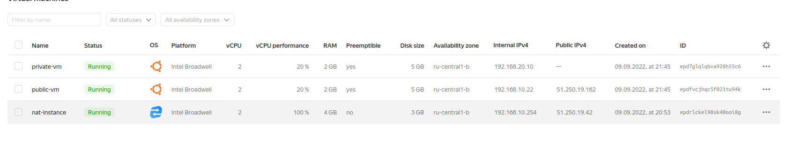

# Домашнее задание к занятию "15.1. Организация сети"

Домашнее задание будет состоять из обязательной части, которую необходимо выполнить на провайдере Яндекс.Облако и дополнительной части в AWS по желанию. Все домашние задания в 15 блоке связаны друг с другом и в конце представляют пример законченной инфраструктуры.  
Все задания требуется выполнить с помощью Terraform, результатом выполненного домашнего задания будет код в репозитории. 

Перед началом работ следует настроить доступ до облачных ресурсов из Terraform используя материалы прошлых лекций и [ДЗ](https://github.com/netology-code/virt-homeworks/tree/master/07-terraform-02-syntax ). А также заранее выбрать регион (в случае AWS) и зону.

---
---
## Задание 1. Яндекс.Облако (обязательное к выполнению)

1. Создать VPC.
- Создать пустую VPC. Выбрать зону.


```
resource "yandex_vpc_network" "vpc1" {
  name = "network-vpc1"
}
```
Наша VPC будет называться `network-vpc1`.


2. Публичная подсеть.
- Создать в vpc subnet с названием public, сетью 192.168.10.0/24.
```
resource "yandex_vpc_subnet" "public" {
  v4_cidr_blocks = ["192.168.10.0/24"]
  zone           = "ru-central1-b"
  network_id     = yandex_vpc_network.vpc1.id
  name           = "public"
}
```
- Создать в этой подсети NAT-инстанс, присвоив ему адрес 192.168.10.254. В качестве image_id использовать fd80mrhj8fl2oe87o4e1
```
resource "yandex_compute_instance" "nat-instance" {
  name        = "nat-instance"
  platform_id = "standard-v1"
  zone        = "ru-central1-b"

  resources {
    cores  = 2
    memory = 4
  }

  boot_disk {
    initialize_params {
      image_id = "fd80mrhj8fl2oe87o4e1"
    }
  }

  network_interface {
    subnet_id  = yandex_vpc_subnet.public.id
    ip_address = "192.168.10.254"
    nat        = true
  }

  metadata = {
    ssh-keys = "ubuntu:${file("~/.ssh/id_rsa.pub")}"
  }
}
```

- Создать в этой публичной подсети виртуалку с публичным IP и подключиться к ней, убедиться что есть доступ к интернету.


Создаем публичную виртуальную машину `public-vm`. За основу берем образ `ubuntu 22.04 LTS`

```
resource "yandex_compute_instance" "public-vm" {
  name = "public-vm"
  scheduling_policy {
    preemptible = true
  }
  resources {
    cores  = 2
    memory = 2
  }

  boot_disk {
    initialize_params {
      image_id = "fd8c00efhiopj3rlnlbn"
    }
  }

  network_interface {
    subnet_id = yandex_vpc_subnet.public.id
    nat       = true
  }

  metadata = {
    ssh-keys = "ubuntu:${file("~/.ssh/id_rsa.pub")}"
  }
}
```


3. Приватная подсеть.
- Создать в vpc subnet с названием private, сетью 192.168.20.0/24.
```
resource "yandex_vpc_subnet" "private" {
  v4_cidr_blocks = ["192.168.20.0/24"]
  zone           = "ru-central1-b"
  network_id     = yandex_vpc_network.vpc1.id
  route_table_id = yandex_vpc_route_table.nat-route.id
  name           = "private"
}
```
- Создать route table. Добавить статический маршрут, направляющий весь исходящий трафик private сети в NAT-инстанс


```
resource "yandex_vpc_route_table" "nat-route" {
  network_id = "${yandex_vpc_network.network-test.id}"

  static_route {
    destination_prefix = "0.0.0.0/0"
    next_hop_address   = "192.168.10.254"
  }
}
```


- Создать в этой приватной подсети виртуалку с внутренним IP, подключиться к ней через виртуалку, созданную ранее и убедиться что есть доступ к интернету

```
  name = "private-vm"
  scheduling_policy {
    preemptible = true
  }
  resources {
    cores         = 2
    memory        = 2
    core_fraction = 20
  }

  boot_disk {
    initialize_params {
      image_id = "fd8c00efhiopj3rlnlbn"
    }
  }

  network_interface {
    subnet_id = yandex_vpc_subnet.private.id
  }

  metadata = {
    ssh-keys = "ubuntu:${file("~/.ssh/id_rsa.pub")}"
  }
}
```


```
vlad@vlad705:~/nl/devops-netology/15.1/tf$ ssh ubuntu@51.250.19.162
Welcome to Ubuntu 22.04.1 LTS (GNU/Linux 5.15.0-47-generic x86_64)

 * Documentation:  https://help.ubuntu.com
 * Management:     https://landscape.canonical.com
 * Support:        https://ubuntu.com/advantage

  System information as of Fri Sep  9 06:47:42 PM UTC 2022

  System load:  1.69482421875     Processes:             136
  Usage of /:   83.2% of 4.84GB   Users logged in:       0
  Memory usage: 9%                IPv4 address for eth0: 192.168.10.22
  Swap usage:   0%


0 updates can be applied immediately.


The programs included with the Ubuntu system are free software;
the exact distribution terms for each program are described in the
individual files in /usr/share/doc/*/copyright.

Ubuntu comes with ABSOLUTELY NO WARRANTY, to the extent permitted by
applicable law.

To run a command as administrator (user "root"), use "sudo <command>".
See "man sudo_root" for details.

ubuntu@epdfvcjhqc5f021tu94k:~$ 


ubuntu@epdfvcjhqc5f021tu94k:~$ ping 1.1.1.1
PING 1.1.1.1 (1.1.1.1) 56(84) bytes of data.
64 bytes from 1.1.1.1: icmp_seq=1 ttl=61 time=7.94 ms
64 bytes from 1.1.1.1: icmp_seq=2 ttl=61 time=7.24 ms```
```

 Подключаемся из публичной машине(`public-vm`) к приватной машине(`private-vm`) по SSH и проверяем доступность во внешнюю сеть Интернет:
```
ubuntu@epd7glqlqbva928h55c6:~$ ssh 192.168.20.10
Welcome to Ubuntu 22.04.1 LTS (GNU/Linux 5.15.0-47-generic x86_64)

 * Documentation:  https://help.ubuntu.com
 * Management:     https://landscape.canonical.com
 * Support:        https://ubuntu.com/advantage

  System information as of Fri Sep  9 06:51:02 PM UTC 2022

  System load:  1.39134254239     Processes:             137
  Usage of /:   84.5% of 4.84GB   Users logged in:       0
  Memory usage: 10%                IPv4 address for eth0: 192.168.20.10
  Swap usage:   0%


0 updates can be applied immediately.


The programs included with the Ubuntu system are free software;
the exact distribution terms for each program are described in the
individual files in /usr/share/doc/*/copyright.

Ubuntu comes with ABSOLUTELY NO WARRANTY, to the extent permitted by
applicable law.

To run a command as administrator (user "root"), use "sudo <command>".
See "man sudo_root" for details.

ubuntu@epd7glqlqbva928h55c6~$ ping 1.1.1.1
PING 1.1.1.1 (1.1.1.1) 56(84) bytes of data.
64 bytes from 1.1.1.1: icmp_seq=1 ttl=59 time=10.9 ms
64 bytes from 1.1.1.1: icmp_seq=2 ttl=59 time=11.9 ms
```

