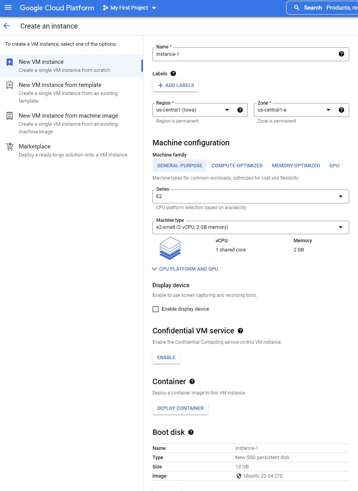

#Домашнее задание к занятию "12.1 Компоненты Kubernetes"

Вы DevOps инженер в крупной компании с большим парком сервисов. Ваша задача — разворачивать эти продукты в корпоративном кластере.

##Задача 1: Установить Minikube
Для экспериментов и валидации ваших решений вам нужно подготовить тестовую среду для работы с Kubernetes. Оптимальное решение — развернуть на рабочей машине Minikube.

Как поставить на AWS:
-создать EC2 виртуальную машину (Ubuntu Server 20.04 LTS (HVM), SSD Volume Type) с типом t3.small. Для работы потребуется настроить Security Group для доступа по ssh. Не забудьте указать keypair, он потребуется для подключения.
-подключитесь к серверу по ssh (ssh ubuntu@<ipv4_public_ip> -i .pem)

*Я ИСПОЛЬЗОВАЛ GOOGLE CLOUD,  так как  раз  там недавно начал свой 90-дневный Free trial *



-установите миникуб и докер следующими командами:
```
curl -LO https://storage.googleapis.com/kubernetes-release/release/`curl -s https://storage.googleapis.com/kubernetes-release/release/stable.txt`/bin/linux/amd64/kubectl
chmod +x ./kubectl
sudo mv ./kubectl /usr/local/bin/kubectl
sudo apt-get update && sudo apt-get install docker.io conntrack -y
curl -Lo minikube https://storage.googleapis.com/minikube/releases/latest/minikube-linux-amd64 && chmod +x minikube && sudo mv minikube /usr/local/bin/
```
```
vladyezh@instance-1:~$ curl -LO https://storage.googleapis.com/kubernetes-release/release/`curl -s https://storage.googleapis.com/kubernetes-release/release/stable.txt`/bin/linux/amd64/kubectl
  % Total    % Received % Xferd  Average Speed   Time    Time     Time  Current
                                 Dload  Upload   Total   Spent    Left  Speed
100 43.5M  100 43.5M    0     0   213M      0 --:--:-- --:--:-- --:--:--  213M
vladyezh@instance-1:~$ chmod +x ./kubectl
vladyezh@instance-1:~$ sudo mv ./kubectl /usr/local/bin/kubectl
vladyezh@instance-1:~$ sudo apt-get update && sudo apt-get install docker.io conntrack -y
Hit:1 http://us-central1.gce.archive.ubuntu.com/ubuntu focal InRelease
Get:2 http://us-central1.gce.archive.ubuntu.com/ubuntu focal-updates InRelease [114 kB]
Get:3 http://us-central1.gce.archive.ubuntu.com/ubuntu focal-backports InRelease [108 kB]
Get:4 http://security.ubuntu.com/ubuntu focal-security InRelease [114 kB]
Get:5 http://us-central1.gce.archive.ubuntu.com/ubuntu focal/universe amd64 Packages [8628 kB]
Get:6 http://us-central1.gce.archive.ubuntu.com/ubuntu focal/universe Translation-en [5124 kB]
Get:7 http://us-central1.gce.archive.ubuntu.com/ubuntu focal/universe amd64 c-n-f Metadata [265 kB]
Get:8 http://us-central1.gce.archive.ubuntu.com/ubuntu focal/multiverse amd64 Packages [144 kB]
Get:9 http://us-central1.gce.archive.ubuntu.com/ubuntu focal/multiverse Translation-en [104 kB]
Get:10 http://us-central1.gce.archive.ubuntu.com/ubuntu focal/multiverse amd64 c-n-f Metadata [9136 B]
Get:11 http://us-central1.gce.archive.ubuntu.com/ubuntu focal-updates/main amd64 Packages [1830 kB]
Get:12 http://us-central1.gce.archive.ubuntu.com/ubuntu focal-updates/main Translation-en [336 kB]
Get:13 http://us-central1.gce.archive.ubuntu.com/ubuntu focal-updates/main amd64 c-n-f Metadata [15.4 kB]
Get:14 http://us-central1.gce.archive.ubuntu.com/ubuntu focal-updates/restricted amd64 Packages [1008 kB]
Get:15 http://us-central1.gce.archive.ubuntu.com/ubuntu focal-updates/restricted Translation-en [143 kB]
Get:16 http://us-central1.gce.archive.ubuntu.com/ubuntu focal-updates/restricted amd64 c-n-f Metadata [520 B]
Get:17 http://us-central1.gce.archive.ubuntu.com/ubuntu focal-updates/universe amd64 Packages [924 kB]
Get:18 http://us-central1.gce.archive.ubuntu.com/ubuntu focal-updates/universe Translation-en [207 kB]
Get:19 http://us-central1.gce.archive.ubuntu.com/ubuntu focal-updates/universe amd64 c-n-f Metadata [20.7 kB]
Get:20 http://us-central1.gce.archive.ubuntu.com/ubuntu focal-updates/multiverse amd64 Packages [24.4 kB]
Get:21 http://us-central1.gce.archive.ubuntu.com/ubuntu focal-updates/multiverse Translation-en [7336 B]
Get:22 http://us-central1.gce.archive.ubuntu.com/ubuntu focal-updates/multiverse amd64 c-n-f Metadata [596 B]
Get:23 http://us-central1.gce.archive.ubuntu.com/ubuntu focal-backports/main amd64 Packages [44.5 kB]
Get:24 http://us-central1.gce.archive.ubuntu.com/ubuntu focal-backports/main Translation-en [10.9 kB]
Get:25 http://us-central1.gce.archive.ubuntu.com/ubuntu focal-backports/main amd64 c-n-f Metadata [980 B]
Get:26 http://us-central1.gce.archive.ubuntu.com/ubuntu focal-backports/restricted amd64 c-n-f Metadata [116 B]
Get:27 http://us-central1.gce.archive.ubuntu.com/ubuntu focal-backports/universe amd64 Packages [23.6 kB]
Get:28 http://us-central1.gce.archive.ubuntu.com/ubuntu focal-backports/universe Translation-en [15.9 kB]
Get:29 http://us-central1.gce.archive.ubuntu.com/ubuntu focal-backports/universe amd64 c-n-f Metadata [860 B]
Get:30 http://us-central1.gce.archive.ubuntu.com/ubuntu focal-backports/multiverse amd64 c-n-f Metadata [116 B]
Get:31 http://security.ubuntu.com/ubuntu focal-security/main amd64 Packages [1480 kB]
Get:32 http://security.ubuntu.com/ubuntu focal-security/main Translation-en [255 kB]
Get:33 http://security.ubuntu.com/ubuntu focal-security/main amd64 c-n-f Metadata [10.4 kB]
Get:34 http://security.ubuntu.com/ubuntu focal-security/restricted amd64 Packages [938 kB]
Get:35 http://security.ubuntu.com/ubuntu focal-security/restricted Translation-en [134 kB]
Get:36 http://security.ubuntu.com/ubuntu focal-security/restricted amd64 c-n-f Metadata [520 B]
Get:37 http://security.ubuntu.com/ubuntu focal-security/universe amd64 Packages [703 kB]
Get:38 http://security.ubuntu.com/ubuntu focal-security/universe Translation-en [126 kB]
Get:39 http://security.ubuntu.com/ubuntu focal-security/universe amd64 c-n-f Metadata [14.4 kB]
Get:40 http://security.ubuntu.com/ubuntu focal-security/multiverse amd64 Packages [22.2 kB]
Get:41 http://security.ubuntu.com/ubuntu focal-security/multiverse Translation-en [5376 B]
Get:42 http://security.ubuntu.com/ubuntu focal-security/multiverse amd64 c-n-f Metadata [512 B]
Fetched 22.9 MB in 4s (5555 kB/s)                          
Reading package lists... Done
Reading package lists... Done
Building dependency tree       
Reading state information... Done
The following packages were automatically installed and are no longer required:
  libatasmart4 libblockdev-fs2 libblockdev-loop2 libblockdev-part-err2 libblockdev-part2 libblockdev-swap2 libblockdev-utils2 libblockdev2 libmm-glib0 libnspr4 libnss3 libnuma1
  libparted-fs-resize0 libudisks2-0 usb-modeswitch usb-modeswitch-data
Use 'sudo apt autoremove' to remove them.
The following additional packages will be installed:
  bridge-utils containerd dns-root-data dnsmasq-base libidn11 pigz runc ubuntu-fan
Suggested packages:
  ifupdown nftables aufs-tools cgroupfs-mount | cgroup-lite debootstrap docker-doc rinse zfs-fuse | zfsutils
The following NEW packages will be installed:
  bridge-utils conntrack containerd dns-root-data dnsmasq-base docker.io libidn11 pigz runc ubuntu-fan
0 upgraded, 10 newly installed, 0 to remove and 52 not upgraded.
Need to get 69.3 MB of archives.
After this operation, 335 MB of additional disk space will be used.
Get:1 http://us-central1.gce.archive.ubuntu.com/ubuntu focal/universe amd64 pigz amd64 2.4-1 [57.4 kB]
Get:2 http://us-central1.gce.archive.ubuntu.com/ubuntu focal/main amd64 bridge-utils amd64 1.6-2ubuntu1 [30.5 kB]
Get:3 http://us-central1.gce.archive.ubuntu.com/ubuntu focal/main amd64 conntrack amd64 1:1.4.5-2 [30.3 kB]
Get:4 http://us-central1.gce.archive.ubuntu.com/ubuntu focal-updates/main amd64 runc amd64 1.1.0-0ubuntu1~20.04.1 [3892 kB]
Get:5 http://us-central1.gce.archive.ubuntu.com/ubuntu focal-updates/main amd64 containerd amd64 1.5.9-0ubuntu1~20.04.4 [33.0 MB]
Get:6 http://us-central1.gce.archive.ubuntu.com/ubuntu focal/main amd64 dns-root-data all 2019052802 [5300 B]
Get:7 http://us-central1.gce.archive.ubuntu.com/ubuntu focal/main amd64 libidn11 amd64 1.33-2.2ubuntu2 [46.2 kB]
Get:8 http://us-central1.gce.archive.ubuntu.com/ubuntu focal-updates/main amd64 dnsmasq-base amd64 2.80-1.1ubuntu1.5 [315 kB]
Get:9 http://us-central1.gce.archive.ubuntu.com/ubuntu focal-updates/universe amd64 docker.io amd64 20.10.12-0ubuntu2~20.04.1 [31.8 MB]
Get:10 http://us-central1.gce.archive.ubuntu.com/ubuntu focal-updates/main amd64 ubuntu-fan all 0.12.13ubuntu0.1 [34.4 kB]
Fetched 69.3 MB in 2s (40.6 MB/s)       
Preconfiguring packages ...
Selecting previously unselected package pigz.
(Reading database ... 60927 files and directories currently installed.)
Preparing to unpack .../0-pigz_2.4-1_amd64.deb ...
Unpacking pigz (2.4-1) ...
Selecting previously unselected package bridge-utils.
Preparing to unpack .../1-bridge-utils_1.6-2ubuntu1_amd64.deb ...
Unpacking bridge-utils (1.6-2ubuntu1) ...
Selecting previously unselected package conntrack.
Preparing to unpack .../2-conntrack_1%3a1.4.5-2_amd64.deb ...
Unpacking conntrack (1:1.4.5-2) ...
Selecting previously unselected package runc.
Preparing to unpack .../3-runc_1.1.0-0ubuntu1~20.04.1_amd64.deb ...
Unpacking runc (1.1.0-0ubuntu1~20.04.1) ...
Selecting previously unselected package containerd.
Preparing to unpack .../4-containerd_1.5.9-0ubuntu1~20.04.4_amd64.deb ...
Unpacking containerd (1.5.9-0ubuntu1~20.04.4) ...
Selecting previously unselected package dns-root-data.
Preparing to unpack .../5-dns-root-data_2019052802_all.deb ...
Unpacking dns-root-data (2019052802) ...
Selecting previously unselected package libidn11:amd64.
Preparing to unpack .../6-libidn11_1.33-2.2ubuntu2_amd64.deb ...
Unpacking libidn11:amd64 (1.33-2.2ubuntu2) ...
Selecting previously unselected package dnsmasq-base.
Preparing to unpack .../7-dnsmasq-base_2.80-1.1ubuntu1.5_amd64.deb ...
Unpacking dnsmasq-base (2.80-1.1ubuntu1.5) ...
Selecting previously unselected package docker.io.
Preparing to unpack .../8-docker.io_20.10.12-0ubuntu2~20.04.1_amd64.deb ...
Unpacking docker.io (20.10.12-0ubuntu2~20.04.1) ...
Selecting previously unselected package ubuntu-fan.
Preparing to unpack .../9-ubuntu-fan_0.12.13ubuntu0.1_all.deb ...
Unpacking ubuntu-fan (0.12.13ubuntu0.1) ...
Setting up conntrack (1:1.4.5-2) ...
Setting up runc (1.1.0-0ubuntu1~20.04.1) ...
Setting up dns-root-data (2019052802) ...
Setting up libidn11:amd64 (1.33-2.2ubuntu2) ...
Setting up bridge-utils (1.6-2ubuntu1) ...
Setting up pigz (2.4-1) ...
Setting up containerd (1.5.9-0ubuntu1~20.04.4) ...
Created symlink /etc/systemd/system/multi-user.target.wants/containerd.service → /lib/systemd/system/containerd.service.
Setting up docker.io (20.10.12-0ubuntu2~20.04.1) ...
Adding group `docker' (GID 120) ...
Done.
Created symlink /etc/systemd/system/multi-user.target.wants/docker.service → /lib/systemd/system/docker.service.
Created symlink /etc/systemd/system/sockets.target.wants/docker.socket → /lib/systemd/system/docker.socket.
^[[6~Setting up dnsmasq-base (2.80-1.1ubuntu1.5) ...
Setting up ubuntu-fan (0.12.13ubuntu0.1) ...
Created symlink /etc/systemd/system/multi-user.target.wants/ubuntu-fan.service → /lib/systemd/system/ubuntu-fan.service.
Processing triggers for systemd (245.4-4ubuntu3.16) ...
Processing triggers for man-db (2.9.1-1) ...
Processing triggers for dbus (1.12.16-2ubuntu2.1) ...
Processing triggers for libc-bin (2.31-0ubuntu9.7) ...
vladyezh@instance-1:~$ curl -Lo minikube https://storage.googleapis.com/minikube/releases/latest/minikube-linux-amd64 && chmod +x minikube && sudo mv minikube /usr/local/bin/
  % Total    % Received % Xferd  Average Speed   Time    Time     Time  Current
                                 Dload  Upload   Total   Spent    Left  Speed
100 69.2M  100 69.2M    0     0   238M      0 --:--:-- --:--:-- --:--:--  238M
```

-проверить версию можно командой minikube version
```
vladyezh@instance-1:~$ minikube version
minikube version: v1.25.2
commit: 362d5fdc0a3dbee389b3d3f1034e8023e72bd3a7
```

-переключаемся на root и запускаем миникуб: minikube start --vm-driver=none
```
vladyezh@instance-1:~$ sudo -i
root@instance-1:~# minikube start --vm-driver=none
😄  minikube v1.25.2 on Ubuntu 20.04 (amd64)
✨  Using the none driver based on user configuration

🧯  The requested memory allocation of 1974MiB does not leave room for system overhead (total system memory: 1974MiB). You may face stability issues.
💡  Suggestion: Start minikube with less memory allocated: 'minikube start --memory=1974mb'

👍  Starting control plane node minikube in cluster minikube
🤹  Running on localhost (CPUs=2, Memory=1974MB, Disk=9749MB) ...
ℹ️  OS release is Ubuntu 20.04.4 LTS
🐳  Preparing Kubernetes v1.23.3 on Docker 20.10.12 ...
    ▪ kubelet.resolv-conf=/run/systemd/resolve/resolv.conf
    ▪ kubelet.housekeeping-interval=5m
    > kubectl.sha256: 64 B / 64 B [--------------------------] 100.00% ? p/s 0s
    > kubelet.sha256: 64 B / 64 B [--------------------------] 100.00% ? p/s 0s
    > kubeadm.sha256: 64 B / 64 B [--------------------------] 100.00% ? p/s 0s
    > kubeadm: 43.12 MiB / 43.12 MiB [-----------] 100.00% 348.47 MiB p/s 300ms
    > kubectl: 44.43 MiB / 44.43 MiB [-----------] 100.00% 264.28 MiB p/s 400ms
    > kubelet: 118.75 MiB / 118.75 MiB [---------] 100.00% 244.90 MiB p/s 700ms

    ▪ Generating certificates and keys ...
    ▪ Booting up control plane ...
    ▪ Configuring RBAC rules ...
🤹  Configuring local host environment ...

❗  The 'none' driver is designed for experts who need to integrate with an existing VM
💡  Most users should use the newer 'docker' driver instead, which does not require root!
📘  For more information, see: https://minikube.sigs.k8s.io/docs/reference/drivers/none/

❗  kubectl and minikube configuration will be stored in /root
❗  To use kubectl or minikube commands as your own user, you may need to relocate them. For example, to overwrite your own settings, run:

    ▪ sudo mv /root/.kube /root/.minikube $HOME
    ▪ sudo chown -R $USER $HOME/.kube $HOME/.minikube

💡  This can also be done automatically by setting the env var CHANGE_MINIKUBE_NONE_USER=true
🔎  Verifying Kubernetes components...
    ▪ Using image gcr.io/k8s-minikube/storage-provisioner:v5
🌟  Enabled addons: default-storageclass, storage-provisioner
🏄  Done! kubectl is now configured to use "minikube" cluster and "default" namespace by default
```

-после запуска стоит проверить статус: minikube status
```
root@instance-1:~# minikube status
minikube
type: Control Plane
host: Running
kubelet: Running
apiserver: Running
kubeconfig: Configured
```

-запущенные служебные компоненты можно увидеть командой: kubectl get pods --namespace=kube-system

```
root@instance-1:~# kubectl get pods --namespace=kube-system
NAME                                 READY   STATUS    RESTARTS   AGE
coredns-64897985d-t9kqn              0/1     Running   0          40s
etcd-instance-1                      1/1     Running   0          51s
kube-apiserver-instance-1            1/1     Running   0          51s
kube-controller-manager-instance-1   1/1     Running   0          51s
kube-proxy-7p6wz                     1/1     Running   0          40s
kube-scheduler-instance-1            1/1     Running   0          51s
storage-provisioner                  1/1     Running   0          48s
root@instance-1:~# 
```

-Для сброса кластера стоит удалить кластер и создать заново:
minikube delete
minikube start --vm-driver=none
Возможно, для повторного запуска потребуется выполнить команду: sudo sysctl fs.protected_regular=0

```
root@instance-1:~# minikube delete
🔄  Uninstalling Kubernetes v1.23.3 using kubeadm ...
🔥  Deleting "minikube" in none ...
🔥  Trying to delete invalid profile minikube
root@instance-1:~# minikube start --vm-driver=none
😄  minikube v1.25.2 on Ubuntu 20.04 (amd64)
✨  Using the none driver based on user configuration

🧯  The requested memory allocation of 1974MiB does not leave room for system overhead (total system memory: 1974MiB). You may face stability issues.
💡  Suggestion: Start minikube with less memory allocated: 'minikube start --memory=1974mb'

👍  Starting control plane node minikube in cluster minikube

❌  Exiting due to HOST_JUJU_LOCK_PERMISSION: Failed to save config: failed to acquire lock for /root/.minikube/profiles/minikube/config.json: {Name:mk270d1b5db5965f2dc9e9e25770a63417031943 Clock:{} Delay:500ms Timeout:1m0s Cancel:<nil>}: unable to open /tmp/juju-mk270d1b5db5965f2dc9e9e25770a63417031943: permission denied
💡  Suggestion: Run 'sudo sysctl fs.protected_regular=0', or try a driver which does not require root, such as '--driver=docker'
🍿  Related issue: https://github.com/kubernetes/minikube/issues/6391

root@instance-1:~# sudo sysctl fs.protected_regular=0
fs.protected_regular = 0
root@instance-1:~# minikube start --vm-driver=none
😄  minikube v1.25.2 on Ubuntu 20.04 (amd64)
✨  Using the none driver based on user configuration

🧯  The requested memory allocation of 1974MiB does not leave room for system overhead (total system memory: 1974MiB). You may face stability issues.
💡  Suggestion: Start minikube with less memory allocated: 'minikube start --memory=1974mb'

👍  Starting control plane node minikube in cluster minikube
🤹  Running on localhost (CPUs=2, Memory=1974MB, Disk=9749MB) ...
ℹ️  OS release is Ubuntu 20.04.4 LTS
🐳  Preparing Kubernetes v1.23.3 on Docker 20.10.12 ...
    ▪ kubelet.resolv-conf=/run/systemd/resolve/resolv.conf
    ▪ kubelet.housekeeping-interval=5m
    ▪ Generating certificates and keys ...
    ▪ Booting up control plane ...
    ▪ Configuring RBAC rules ...
🤹  Configuring local host environment ...

❗  The 'none' driver is designed for experts who need to integrate with an existing VM
💡  Most users should use the newer 'docker' driver instead, which does not require root!
📘  For more information, see: https://minikube.sigs.k8s.io/docs/reference/drivers/none/

❗  kubectl and minikube configuration will be stored in /root
❗  To use kubectl or minikube commands as your own user, you may need to relocate them. For example, to overwrite your own settings, run:

    ▪ sudo mv /root/.kube /root/.minikube $HOME
    ▪ sudo chown -R $USER $HOME/.kube $HOME/.minikube

💡  This can also be done automatically by setting the env var CHANGE_MINIKUBE_NONE_USER=true
🔎  Verifying Kubernetes components...
    ▪ Using image gcr.io/k8s-minikube/storage-provisioner:v5
🌟  Enabled addons: default-storageclass, storage-provisioner
🏄  Done! kubectl is now configured to use "minikube" cluster and "default" namespace by default
```
##Задача 2: Запуск Hello World
После установки Minikube требуется его проверить. Для этого подойдет стандартное приложение hello world. А для доступа к нему потребуется ingress.

-развернуть через Minikube тестовое приложение по туториалу
-установить аддоны ingress и dashboard
```
root@instance-1:~# kubectl create deployment hello-node --image=k8s.gcr.io/echoserver:1.4
deployment.apps/hello-node created

root@instance-1:~# kubectl get deployments
NAME         READY   UP-TO-DATE   AVAILABLE   AGE
hello-node   0/1     1            0           11s


^Croot@instance-1:~# kubectl port-forward services/hello-node 8080:8080 --address 10.128.0.2
Forwarding from 10.128.0.2:8080 -> 8080
Handling connection for 8080
E0531 20:43:52.626979   21092 portforward.go:406] an error occurred forwarding 8080 -> 8080: error forwarding port 8080 to pod 855ede077efa6a1a85ceee79e66c650814b014ba587ce5a6b47f777092332e4b, uid : unable to do port forwarding: socat not found
E0531 20:43:52.627666   21092 portforward.go:234] lost connection to pod
root@instance-1:~# kubectl get services
NAME         TYPE           CLUSTER-IP      EXTERNAL-IP   PORT(S)          AGE
hello-node   LoadBalancer   10.105.148.77   <pending>     8080:32308/TCP   8m57s
kubernetes   ClusterIP      10.96.0.1       <none>        443/TCP          23h
root@instance-1:~# minikube addons list^C
root@instance-1:~# ^C
root@instance-1:~# root@instance-1:~# minikube addons list
ube addons enable dashboard
    ▪ Usinroot@instance-1:~#: command not found
root@instance-1:~# |-----------------------------|----------|--------------|--------------------------------|
-bash: syntax error near unexpected token `|'
root@instance-1:~# |         ADDON NAME          | PROFILE  |    STATUS    |           MAINTAINER           |
-bash: syntax error near unexpected token `|'
root@instance-1:~# |-----------------------------|----------|--------------|--------------------------------|
-bash: syntax error near unexpected token `|'
root@instance-1:~# | ambassador                  | minikube | disabled     | third-party (ambassador)       |
-bash: syntax error near unexpected token `|'
root@instance-1:~# | auto-pause                  | minikube | disabled     | google                         |
-bash: syntax error near unexpected token `|'
root@instance-1:~# | csi-hostpath-driver         | minikube | disabled     | kubernetes                     |
-bash: syntax error near unexpected token `|'
root@instance-1:~# | dashboard                   | minikube | enabled ✅   | kubernetes                     |
-bash: syntax error near unexpected token `|'
root@instance-1:~# | default-storageclass        | minikube | enabled ✅   | kubernetes                     |
-bash: syntax error near unexpected token `|'
root@instance-1:~# | efk                         | minikube | disabled     | third-party (elastic)          |
-bash: syntax error near unexpected token `|'
root@instance-1:~# | freshpod                    | minikube | disabled     | google                         |
-bash: syntax error near unexpected token `|'
root@instance-1:~# | gcp-auth                    | minikube | disabled     | google                         |
-bash: syntax error near unexpected token `|'
root@instance-1:~# | gvisor                      | minikube | disabled     | google                         |
-bash: syntax error near unexpected token `|'
root@instance-1:~# | helm-tiller                 | minikube | disabled     | third-party (helm)             |
-bash: syntax error near unexpected token `|'
root@instance-1:~# | ingress                     | minikube | disabled     | unknown (third-party)          |
-bash: syntax error near unexpected token `|'
root@instance-1:~# | ingress-dns                 | minikube | disabled     | google                         |
-bash: syntax error near unexpected token `|'
root@instance-1:~# | istio                       | minikube | disabled     | third-party (istio)            |
-bash: syntax error near unexpected token `|'
root@instance-1:~# | istio-provisioner           | minikube | disabled     | third-party (istio)            |
-bash: syntax error near unexpected token `|'
root@instance-1:~# | kong                        | minikube | disabled     | third-party (Kong HQ)          |
-bash: syntax error near unexpected token `|'
root@instance-1:~# | kubevirt                    | minikube | disabled     | third-party (kubevirt)         |
-bash: syntax error near unexpected token `|'
root@instance-1:~# | logviewer                   | minikube | disabled     | unknown (third-party)          |
-bash: syntax error near unexpected token `|'
root@instance-1:~# | metallb                     | minikube | disabled     | third-party (metallb)          |
-bash: syntax error near unexpected token `|'
root@instance-1:~# | metrics-server              | minikube | disabled     | kubernetes                     |
-bash: syntax error near unexpected token `|'
root@instance-1:~# | nvidia-driver-installer     | minikube | disabled     | google                         |
-bash: syntax error near unexpected token `|'
root@instance-1:~# | nvidia-gpu-device-plugin    | minikube | disabled     | third-party (nvidia)           |
-bash: syntax error near unexpected token `|'
root@instance-1:~# | olm                         | minikube | disabled     | third-party (operator          |
-bash: syntax error near unexpected token `|'
root@instance-1:~# |                             |     


```


##Задача 3: Установить kubectl
Подготовить рабочую машину для управления корпоративным кластером. Установить клиентское приложение kubectl.

-подключиться к minikube
-проверить работу приложения из задания 2, запустив port-forward до кластера
```

root@instance-1:~# kubectl expose deployment hello-node --type=LoadBalancer --port=8080
service/hello-node exposed
root@instance-1:~# kubectl get services
NAME         TYPE           CLUSTER-IP      EXTERNAL-IP   PORT(S)          AGE
hello-node   LoadBalancer   10.105.148.77   <pending>     8080:32308/TCP   8s
kubernetes   ClusterIP      10.96.0.1       <none>        443/TCP          23h

root@instance-1:~# kubectl get services
NAME         TYPE           CLUSTER-IP      EXTERNAL-IP   PORT(S)          AGE
hello-node   LoadBalancer   10.105.148.77   <pending>     8080:32308/TCP   8m57s
kubernetes   ClusterIP      10.96.0.1       <none>        443/TCP          23h

vladyezh@instance-1:~$ curl  10.105.148.77:8080
CLIENT VALUES:
client_address=172.17.0.1
command=GET
real path=/
query=nil
request_version=1.1
request_uri=http://10.105.148.77:8080/

SERVER VALUES:
server_version=nginx: 1.10.0 - lua: 10001

HEADERS RECEIVED:
accept=*/*
host=10.105.148.77:8080
user-agent=curl/7.68.0
BODY:
-no body in request-vladyezh@instance-1:~

```
